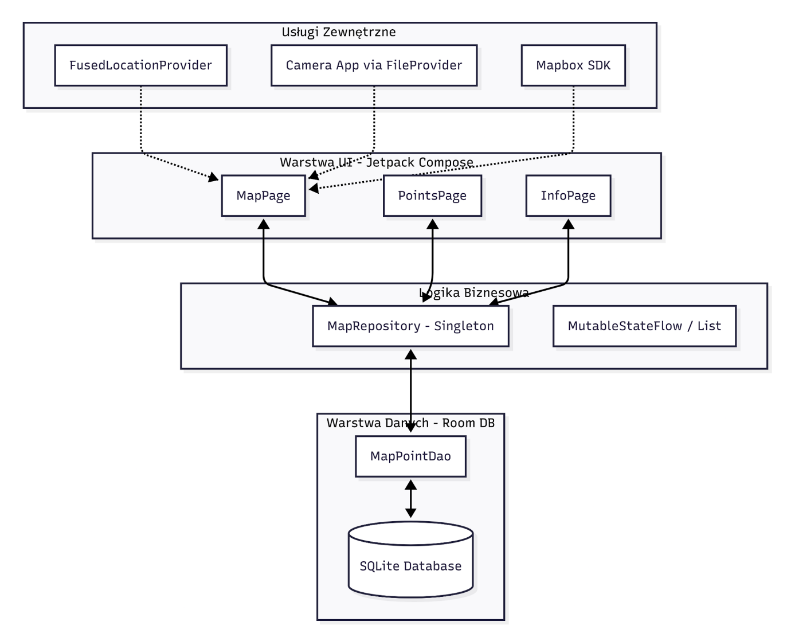
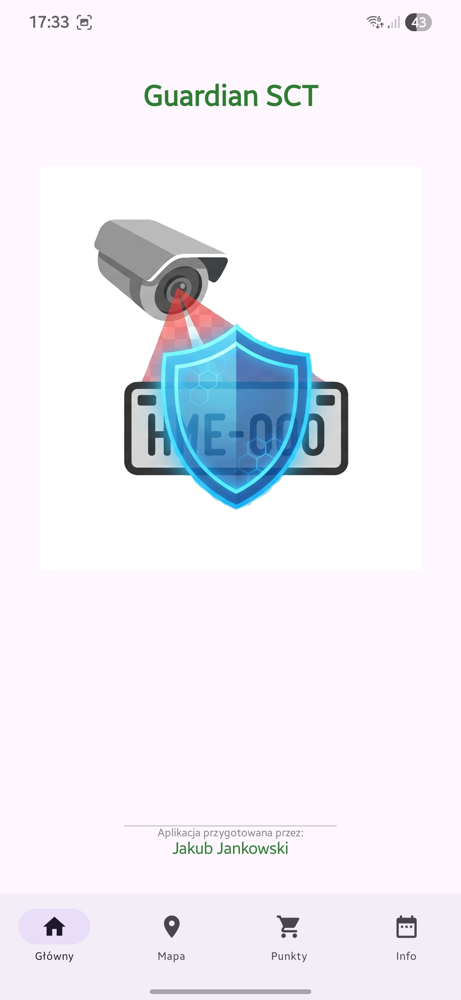
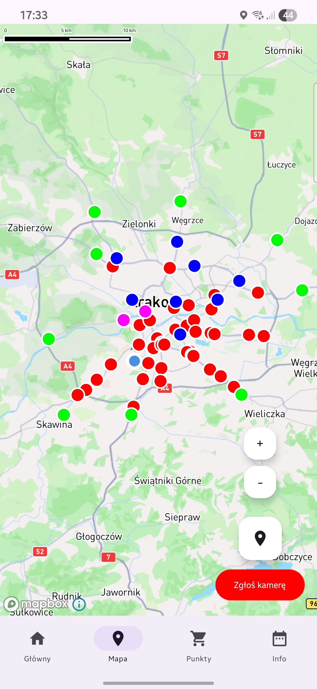
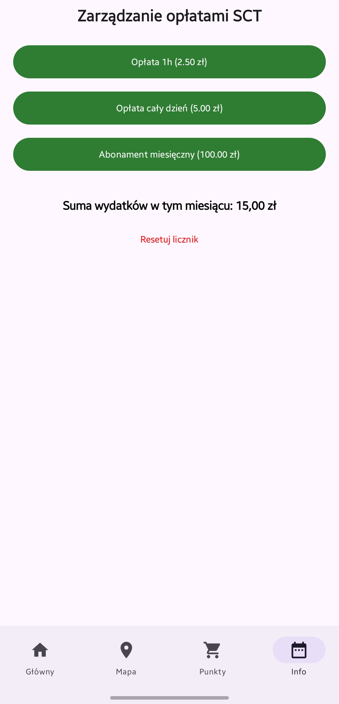

# SCT Guardian

Mobilny system geoinformatyczny wspomagający zarządzanie informacją przestrzenną w kontekście Strefy Czystego Transportu (SCT) w Krakowie.

  

## I. Wstęp i cel projektu

Celem niniejszego projektu było zaprojektowanie i implementacja mobilnego systemu geoinformatycznego o nazwie „SCT Guardian”, wspomagającego zarządzanie informacją przestrzenną w kontekście wprowadzonej Strefy Czystego Transportu (SCT) na terenie Gminy Miejskiej Kraków.

Aplikacja stanowi mobilne narzędzie inwentaryzacyjne działające w trybie crowdsourcingu, umożliwiające użytkownikom bieżące monitorowanie infrastruktury kontrolnej strefy oraz rejestrację nowych punktów weryfikacji pojazdów na podstawie bezpośrednich pomiarów z odbiornika GPS (GNSS) urządzenia mobilnego oraz aparatu kamery.

## II. Wykorzystane technologie

- Kotlin
- Jetpack Compose
- Mapbox SDK
- Room DB
- Google Play Services (Location)

## III. Proces implementacji

Proces wytwórczy oprogramowania został podzielony na pięć kluczowych etapów, zapewniających stabilność i skalowalność systemu:

1. **Konfiguracja środowiska i nawigacji:** Zastosowano model programowania deklaratywnego Jetpack Compose. Architektura nawigacyjna oparta została na komponentach `Scaffold` oraz `NavigationBar`, co pozwoliło na płynną zmianę stanów pomiędzy widokami `MainPage`, `MapPage`, `PointsPage` oraz `InfoPage`. Rozwiązano krytyczne problemy kompatybilności Room/KSP z Kotlinem 2.1.10 poprzez aktualizację bibliotek do wersji 2.7.0-alpha11 oraz konfigurację KSP2.
2. **Integracja silnika Mapbox:** Wdrożono Mapbox Maps SDK (NDK27). Proces ten obejmował konfigurację kluczy dostępu, inicjalizację `MapView` oraz zarządzanie cyklem życia mapy wewnątrz kompozycji Compose za pomocą `AndroidView`.
3. **Usługi lokalizacyjne i uprawnienia:** Wykorzystano `FusedLocationProviderClient` do precyzyjnego pozycjonowania. Zarządzanie uprawnieniami (Fine/Coarse Location) zrealizowano przy pomocy biblioteki Accompanist, zapewniając bezpieczny przepływ pracy w przypadku braku zgody użytkownika.
4. **Warstwa persystencji danych (Room DB):** Zaprojektowano bazę danych SQLite zarządzaną przez Room. Zaimplementowano dwie główne encje: `MapPoint` (dane geoprzestrzenne) oraz `Expense` (finanse). Zastosowano wzorzec Repository, w którym `MapRepository` działa jako Singleton zarządzający reaktywnymi stanami (`mutableStateListOf`) widocznymi w UI.
5. **Integracja sprzętowa i System Plików:**
   - **Aparat:** Wdrożono mechanizm `FileProvider` do bezpiecznego udostępniania URI zdjęć systemowej aplikacji aparatu.
   - **Eksport danych:** Zastosowano Storage Access Framework (SAF) do generowania plików GeoJSON (standard RFC 7946), umożliwiając eksport punktów użytkownika do zewnętrznych systemów GIS.

## IV. Analiza użyteczności (10 heurystyk Nielsena)

Aplikacja została poddana audytowi zgodnie z wytycznymi Jakoba Nielsena:

1. **Widoczność stanu systemu:** Użytkownik jest informowany o postępach za pomocą komunikatów Toast (np. po pomyślnym eksporcie) oraz dynamicznych aktualizacji licznika wydatków w czasie rzeczywistym.
2. **Dopasowanie systemu do świata rzeczywistego:** Użycie standardowych formatów danych (GeoJSON) oraz terminologii znanej kierowcom (opłata godzinowa, abonament).
3. **Kontrola i wolność użytkownika:** Możliwość usuwania błędnie dodanych punktów (przycisk „Clear”) oraz resetowania historii wydatków (`clearExpenses`).
4. **Spójność i standardy:** Interfejs oparty na Material Design 3, spójna kolorystyka (zieleń systemowa `0xFF2E7D32`) oraz standardowe ikony systemowe.
5. **Zapobieganie błędom:** Przycisk eksportu jest nieaktywny (`enabled = points.isNotEmpty()`), dopóki na liście nie znajdą się dane, co zapobiega generowaniu pustych plików.
6. **Rozpoznawanie zamiast przypominania:** Kategorie punktów (Kamery, Info, Płatności) są wizualizowane na mapie różnymi kolorami, co eliminuje konieczność zapamiętywania ich lokalizacji.
7. **Elastyczność i efektywność:** Skróty w `InfoPage` pozwalają na szybkie dodanie najczęstszych kwot opłat za pomocą jednego kliknięcia.
8. **Estetyka i minimalistyczny design:** Strona główna ogranicza się do kluczowych informacji i brandingu, unikając przeładowania informacyjnego.
9. **Pomoc w rozpoznawaniu i naprawie błędów:** Obsługa wyjątków podczas zapisu plików informuje użytkownika o konkretnej przyczynie niepowodzenia (np. brak miejsca).
10. **Pomoc i dokumentacja:** Intuicyjne etykiety w menu nawigacyjnym oraz jasny opis funkcji raportowania.

## V. Architektura i schemat blokowy

Przepływ danych inicjowany jest w warstwie UI. Każda zmiana w bazie danych (np. dodanie punktu) jest natychmiast propagowana przez `MapRepository` do UI dzięki mechanizmom `Flow` i `mutableStateListOf`, co zapewnia reaktywność interfejsu bez konieczności ręcznego odświeżania stron.

## VI. Moduł mapy i lokalizacji GPS

Kluczowym elementem `MapPage.kt` jest zaawansowana integracja komponentów geoprzestrzennych:

- **Inicjalizacja i animacja kamery:** Zastosowano metodę `mapboxMap.flyTo()`. W przeciwieństwie do standardowego `setCamera`, `flyTo` realizuje interpolację parametrów (pozycja, zoom, nachylenie), co zapewnia profesjonalny efekt wizualny płynnego przejścia do lokalizacji użytkownika po uruchomieniu aplikacji.
- **Geopozycjonowanie (GPS):** Wykorzystano `FusedLocationProviderClient` z priorytetem `PRIORITY_HIGH_ACCURACY`. System wykonuje dwustopniowe pobieranie danych: najpierw `lastLocation` dla natychmiastowego efektu, a następnie `getCurrentLocation`, aby zminimalizować błąd paralaksy i zapewnić precyzyjne nanoszenie zgłoszeń.
- **Wizualizacja punktów (Map Styling):** Punkty SCT są renderowane przy użyciu `CircleAnnotation`. Stylizacja jest dynamiczna – na podstawie enuma `PointType` system przypisuje wartości RGB dla parametrów `circleColor`. Pozwala to na natychmiastowe odróżnienie aktywnych kamer (czerwone) od punktów informacyjnych (niebieskie) czy stacji płatności (zielone).
- **Location Puck:** Włączono moduł `locationPuck2D` z aktywnym bearingiem (`bearingImage`). Dzięki temu użytkownik widzi nie tylko swoją pozycję, ale również kierunek, w którym jest zwrócone urządzenie, co jest kluczowe dla orientacji w gęstej zabudowie miejskiej Krakowa.

## Zrzuty ekranu

  
  
  
  

